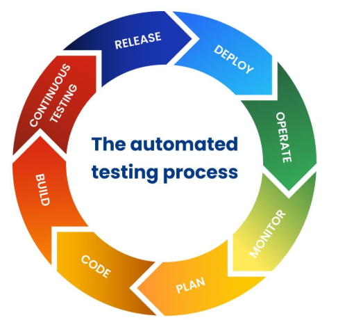
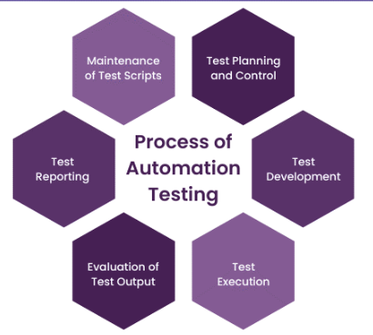
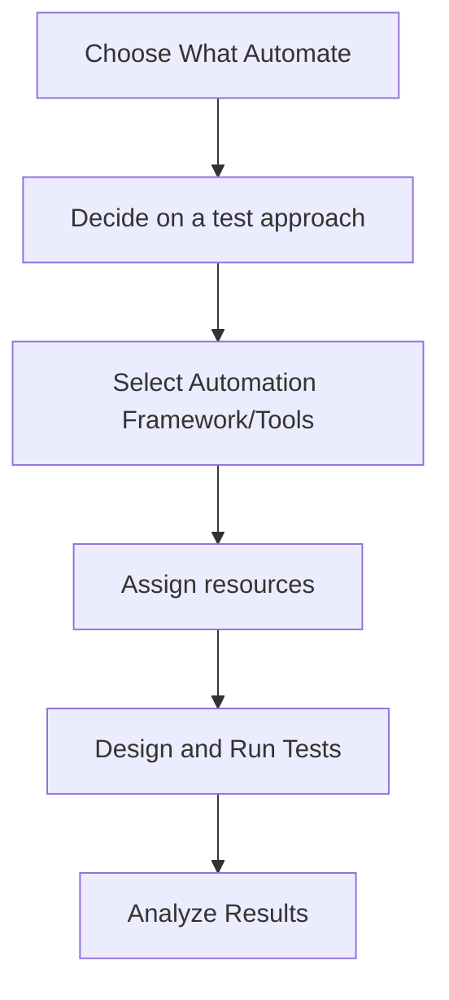
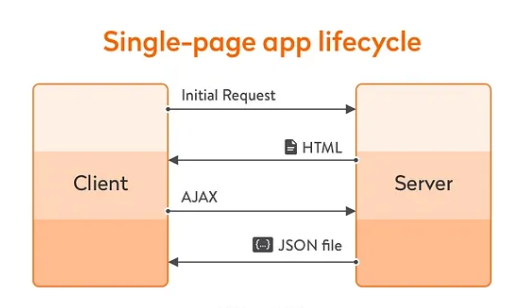
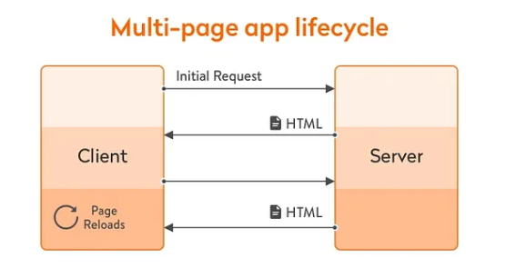

## What is web automation?

- Web automation is the concept of letting software robots perform pre-defined actions, tasks, and processes on a web browser or web application.

- Website test automation uses software tools and scripts to automatically test a website’s functionality, performance, and user experience.

This approach saves time and improves accuracy, ensuring that websites meet quality standards before deployment

Examples of actions in web application that can be automated are:

- Filling out forms and fields
- Scraping content from a web page
- Extracting and transferring data between applications
- Clicking buttons and elements

## Automation Testing Process

## Automation Testing Strategy

## Types of Tests

Below are the different types of automation testing:

- Unit testing
- Integration testing
- Smoke testing
- Performance testing
- Regression testing
- Security testing
- Acceptance testing
- API testing
- UI Testing

## Functional Tests

- Smoke
- Sanity
- Regression
- Unit
- Integration
- API
- UI

## Non-Functional Tests

- Load
- Stress
- Security
- Performance
- Usability
- Reliability
- Scalability

## Difference between Functional and Non-Functional Automated Testing

| Aspect             | Functional Testing                                                    | Non-Functional Testing                                                    |
| -------------------- | -------------------------------------------------------------------------------- | ----------------------------------------------------------------------------------- |
| Objective           | Verifies that the software performs expected functions                         | Evaluates performance, reliability, usability, and other attributes   |
| Examples of Tests	                | Smoke Testing, Sanity Testing, Regression Testing, Unit Testing  | Load testing, stress testing, scalability testing |
| User Involvement	             | Simulates real user interactions	                          | Simulates system behavior under load or constraints       |
| Automation Priority	           | Often automated for regression and CI/CD | Frequently automated for performance benchmarking |

## Structure of Web Applications

A web application or website is a package loaded on the client side containing multiple layers of interdependent modules built on the core web technologies:

- **HTML:** Hypertext markup language, or HTML, is the tag-based document marking system that defines the structure and individual components of what is compiled into the Document Object Model or DOM.

- **CSS:** Cascading style sheet or CSS is the native style description framework used to identify and style different parts of the DOM into the visible area of the page. It selects elements by id, class, and relation to other DOM elements. 

- **JavaScript:** JS is a high-level interpreted scripting language upon which all the dynamic behavior of the application is scripted and executed.

## DevTools

Every modern web browser includes a powerful suite of developer tools. These tools do a range of things, from inspecting currently-loaded HTML, CSS and JavaScript to showing which assets the page has requested and how long they took to load. This article explains how to use the basic functions of your browser's devtools.

How do you pull it up? Three ways:

- Keyboard:

Windows: Ctrl + Shift + I or F12

- Menu bar:

Firefox: Menu (☰) ➤ More tools ➤ Web Developer Tools

Chrome: More tools ➤ Developer tools

Opera: Developer ➤ Developer tools

Safari: Develop ➤ Show Web Inspector.

- Context menu: Press-and-hold/right-click an item on a webpage, and choose Inspect Element from the context menu that appears. (An added bonus: this method straight-away highlights the code of the element you right-clicked.)
  

## Application Structure

Depending on the app, developers might prefer specific approaches to the application structure like:

- **Single-Page app**
- **Multiple Page app** 
- **Progressive Web App (Mobile)** 

## Single Page Applications (SPA)

An SPA (Single-page application) is a web app implementation that loads only a single web document, and then updates the body content of that single document via JavaScript APIs such as Fetch when different content is to be shown.

This therefore allows users to use websites without loading whole new pages from the server, which can result in performance gains and a more dynamic experience, with some tradeoff disadvantages such as SEO, more effort required to maintain state, implement navigation, and do meaningful performance monitoring.

## Multiple Page Applications (MPA)
 
Multi-page applications are websites that have many pages connected. Each page is a separate file, and when users visit these websites, they have to load new pages from the server.

**Multi-page applications (MPAs) provide several benefits to businesses:**

- **Improved SEO:** They help businesses gain better visibility on search engines, attracting more online visitors.
- **Quick initial loading:** MPAs offer a better user experience by loading pages rapidly right from the beginning.
- **Scalability:** They are suitable for larger applications that have a lot of content and receive high levels of traffic.
- **Simplified maintenance and development:** MPAs are easier to maintain and develop, making the process smoother for businesses.
  

### Tip - Steps to Manually Detect SPA
1. Open developer tools / inspector
2. Reload the page or navigate to it
3. Notice the timeline/waterfall of the requests
4. Click on a link or other interaction you have in concern
5. If the timeline refreshes and causes a page reload then it's not an SPA
6. If the timeline shows the first hits and additional hits after your interaction then you have an SPA.

## Task 1

- Choose a Web Page to work with
- Identify the type of the application
- Use DevTools to inspect the page

## Refs:

> Types of tests https://katalon.com/resources-center/blog/automation-testing-types

> Types of tests https://www.geeksforgeeks.org/software-testing/automation-testing-software-testing/ 

> web pages for testing https://www.ministryoftesting.com/articles/websites-to-practice-testing

> DevTools https://developer.mozilla.org/en-US/docs/Learn_web_development/Howto/Tools_and_setup/What_are_browser_developer_tools

> Single Page Applications https://en.wikipedia.org/wiki/Single-page_application

> Single Page Applications https://www.geeksforgeeks.org/javascript/what-is-single-page-application/

> Multiple Page Applications https://medium.com/@julianneagu/multi-page-application-mpa-a-good-business-fit-36029c7be9f0 

