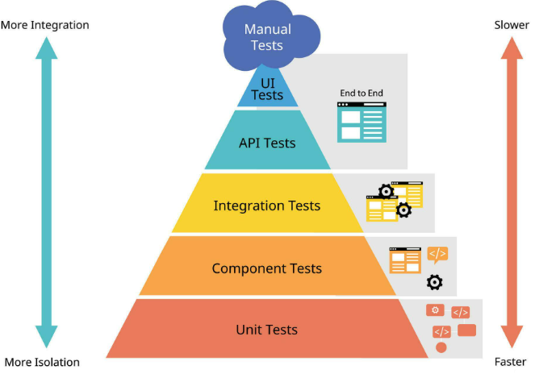
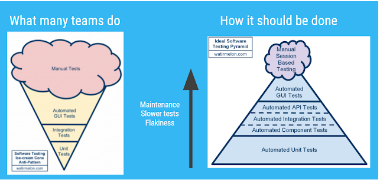

### Benefits of Web Automation

- Faster Execution: Automated tests run significantly faster than manual testing.
- Improved Accuracy: Eliminates human errors by executing tests consistently.
- Enhanced Test Coverage: Allows testing across multiple platforms and environments.
- Cost Efficiency: Reduces long-term testing costs by minimizing manual effort.
- Early Bug Detection: Identifies defects early in development, preventing costly fixes.
- Better Resource Utilization: Frees testers to focus on complex scenarios instead of repetitive tasks.

###  Challenges in Automation Testing

1. Prioritizing which test cases to automate
2. Aligning team communication and goals
3. Selecting appropriate testing tools or frameworks
4. Simulating real-world user conditions
5. Keeping test data and environments updated
6. Handling different devices and OS versions
7. Managing dynamic UI elements during tests
8. Integrating tests into CI/CD pipelines
9. Scaling test environments for multiple tests
10. Analyzing and reporting test results efficiently
11. Automating security validation tests
12. Updating test scripts with application changes
13. Adjusting tests for frequent application updates

## Testing Pyramid

### What is testing piramid?

The test pyramid model, originally introduced by Mike Cohn, helps teams organize and prioritize tests based on their impact, effort, and frequency. The pyramid visually represents how testing should be structured.

## Testing Antipatterns

- Having unit tests without integration tests
- Having integration tests without unit tests
- Having the wrong kind of tests
- Testing the wrong functionality
- Testing internal implementation
- Paying excessive attention to test coverage
- Having flaky or slow tests
- Running tests manually
- Treating test code as a second class citizen
- Not converting production bugs to tests
- Treating TDD as a religion
- Writing tests without reading documentation first
- Giving testing a bad reputation out of ignorance

Some other clasic test automation antipatterns:
- **Including business logic at the test case level instead of building a business layer**. Existing pattern: Page Object Pattern
- **Declaring page elements inline in test cases with locator information instead of in the business layer**. Existing pattern: Page Object Pattern
- **Sleeping for arbitrary amounts of time**. Existing pattern: polling, explicit/implicit waits.
- **Assertions as part of PageObject class** Existing pattern:  PageObject just provides status of the element to the caller. The caller itself will verify the status
- **Different Stack The automated tests (also test frameworks) are implemented using a different software stack than the SUT uses**. *

## Refs.:

> Challenges in Automation Testing - https://www.browserstack.com/guide/challenges-in-automated-testing

> Testing Pyramid - https://www.browserstack.com/guide/testing-pyramid

> Advantages and Disadvantages of Automated Testing - https://www.geeksforgeeks.org/software-engineering/advantages-and-disadvantages-of-automated-testing/

> Software Testing Anti-Pattern List - https://blog.codepipes.com/testing/software-testing-antipatterns.html 