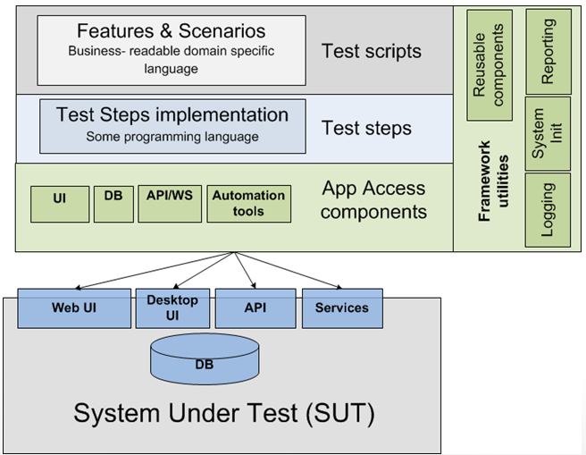
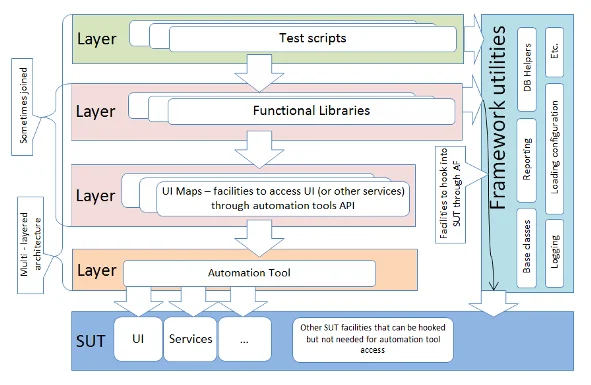

# Automation Testing Technologies


## Record and Play
Record and playback testing is the process where testers record their actions as they manually perform a test on the application’s user interface. As such, it is a form of automated testing since this process is performed by an automated testing tool.

## Libraries
Libraries are collections of pre-written code that can be used to perform specific tasks. They are used to reduce the amount of code that needs to be written and to make the code more reusable.

Python libraries for testing:

* Robot
* PyTest
* Unittest
* DocTest
* Nose2
* Testify


## Frameworks
- Selenium
- Playwright
- Cypress
- TestCafe
- Robotframework
  

## Architecture and Structure

Basic Architecture of Automation Examples





## Folder Structure (Python)

The **“flat layout”** refers to organising a project’s files in a folder or repository, such that the various configuration
files and import packages are all in the top-level directory


<pre style="color:rgb(17, 184, 58);">
├── README.md
├── noxfile.py
├── pyproject.toml
├── setup.py
├── awesome_package/
│   ├── __init__.py
│   └── module.py
│   └── tests/
│       └── test_module.py
│       └── test_module2.py
└── tools/
    ├── generate_awesomeness.py
    └── decrease_world_suck.py
</pre>


The **“src layout”** deviates from the flat layout by moving the code that is intended to be importable (i.e. import
awesome_package, also known as import packages) into a subdirectory. This subdirectory is typically named src/, hence
“src layout”.

<pre style="color:rgb(17, 184, 58);">
├── README.md
├── noxfile.py
├── pyproject.toml
├── setup.py
├── src/
│    └── awesome_package/
│       ├── __init__.py
│       └── module.py
│       └── tests/
│           └── test_module.py
│           └── test_module2.py
└── tools/
    ├── generate_awesomeness.py
    └── decrease_world_suck.py
</pre>


## Helpers vs Utils

|              | Helper Functions/Classes                                     | Utility Functions/Classes                                    |
| ------------ | ------------------------------------------------------------ | ------------------------------------------------------------ |
| Purpose      | Provide support or aid to other parts of the program         | Perform common or generic operations that are not tied to any specific part of the program |
| Scope        | Typically used within a specific module or part of the program | Can be used throughout the program or in multiple programs   |
| Dependencies | Often depend on other parts of the program or external libraries | Usually independent of other parts of the program            |
| Examples     | Form validation functions, data formatting classes           | String manipulation functions, math libraries                |


## Setting Up Web Automation with Python

Python is a popular and versatile programming language. Combining pytest, nose2 with Python allows for efficient and readable
test scripts, making
it a preferred choice for API test automation.

## Setup Environment

> create venv

```shell
python3.12 -m venv venv
```

> activate venv

```shell
venv/bin/activate
```

# Ref.:

> Layouts: https://packaging.python.org/en/latest/discussions/src-layout-vs-flat-layout/

> Test Architecture: https://blog.testproject.io/2020/06/29/design-patterns-in-test-automation/
