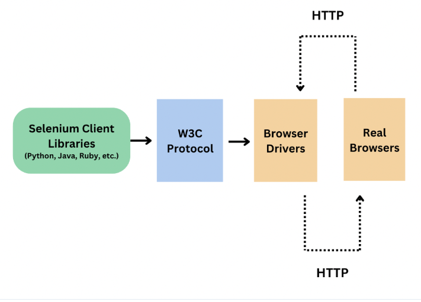

# Selenium

Selenium Tools
- WebDriver
- IDE (Integrated Development Environment) 
- Grid

## Installation

```shell
pip install selenium
```

## WebDriver Architecture

### Selenium 3


### Selenium 4



### Drivers
Starting and stopping a session is for opening and closing a browser.

- **Local Driver** The primary unique argument for starting a local driver includes information about starting the required driver service on the local machine

### Options

- Common Options
  
Examples
> browserName: The name of the browser to be used for the session
```python
options = get_default_chrome_options()
assert options.capabilities['browserName'] == 'chrome'
``` 
> browserVersion: The version of the browser to be used for the session
```python
options = get_default_chrome_options()
assert options.capabilities['browserVersion'] == 'stable'
```

- **Remote Driver**. Selenium lets you automate browsers on remote computers if there is a Selenium Grid running on them
  
Example:
  
```python    
options = get_default_chrome_options()
driver = webdriver.Remote(command_executor=server, options=options)
```
## Browsers 
- Chrome
- Firefox
- Edge
- Safari
  

## Basic Example
```python
from selenium import webdriver
from selenium.webdriver.common.by import By

# Initialize the Chrome driver (ensure you have ChromeDriver installed and in your PATH)
driver = webdriver.Chrome()

# Navigate to a website
driver.get("https://www.google.com")

# Find an element by its name attribute (e.g., the search bar)
search_box = driver.find_element(By.NAME, "q")

# Enter text into the search bar
search_box.send_keys("Selenium Python")

# Submit the form (or press Enter)
search_box.submit()

# Verify the page title after the search
assert "Selenium Python - Google Search" in driver.title

# Close the browser
driver.quit()
```
## Selectors and Locators
| Locator | Description |
| --- | --- |
| id | The id of the element |
| name | The name of the element |
| class_name | The class name of the element |
| tag_name | The tag name of the element |
| link_text | The link text of the element |
| partial_link_text | The partial link text of the element |
| css_selector | The CSS selector of the element |
| xpath | The XPath of the element |

### Relative Locators (from Selenium 4)

- above
- below
- toLeftOf
- toRightOf
- near

## Actions

Basic Commands

- click (applies to any element)
- send keys (only applies to text fields and keyboard interactable elements)
- clear (only applies to text fields and content editable elements)
- submit (only applies to form elements)
- select (see Select List Elements)


## Wait Strategies

### Implicit waits
Selenium has a built-in way to automatically wait for elements called an implicit wait. An implicit wait value can be set either with the timeouts capability in the browser options, or with a driver method 

Example:
```python
options = get_default_chrome_options()
options.page_load_strategy = 'normal'
driver = webdriver.Chrome(options=options)
driver.implicitly_wait(10)
```

### Explicit waits
Explicit waits are loops added to the code that poll the application for a specific condition to evaluate as true before it exits the loop and continues to the next command in the code. If the condition is not met before a designated timeout value, the code will give a timeout error.

Example:
```python
from selenium.webdriver.support.ui import WebDriverWait
from selenium.webdriver.support import expected_conditions as EC
from selenium.webdriver.common.by import By

wait = WebDriverWait(driver, 10)
element = wait.until(EC.presence_of_element_located((By.ID, "myElement")))
```

## Information about web elements

### Is Displayed
This method is used to check if the connected Element is displayed on a webpage. Returns a Boolean value, True if the connected element is displayed in the current browsing context else returns false.

```python
 driver.get("https://www.selenium.dev/selenium/web/inputs.html")

    # isDisplayed
    is_email_visible = driver.find_element(By.NAME, "email_input").is_displayed()
```
### Is Enabled
This method is used to check if the connected Element is enabled on a webpage. Returns a Boolean value, True if the connected element is enabled in the current browsing context else returns false.

```python
is_enabled_button = driver.find_element(By.NAME, "button_input").is_enabled()
```
### Is Selected
This method is used to check if the connected Element is selected on a webpage. Returns a Boolean value, True if the connected element is selected in the current browsing context else returns false.

```python
is_selected_check = driver.find_element(By.NAME, "checkbox_input").is_selected()
```

### Tag Name
This method is used to get the tag name of the connected Element.

```python
 tag_name_inp = driver.find_element(By.NAME, "email_input").tag_name
```

### Size and position
This method is used to get the size and position of the connected Element.

```python
rect = driver.find_element(By.NAME, "range_input").rect
```

### Text Content
This method is used to get the text of the connected Element.

```python
text = driver.find_element(By.TAG_NAME, "h1").text
```
### Get CSS Value
Retrieves the value of specified computed style property of an element in the current browsing context.


```python
css_value = driver.find_element(By.NAME, "color_input").value_of_css_property(
        "font-size"
    )
```
### Fetching Attributes or Properties
Fetches the run time value associated with a DOM attribute. It returns the data associated with the DOM attribute or property of the element.

```python
email_txt = driver.find_element(By.NAME, "email_input")
value_info = email_txt.get_attribute("value")
```
## Page Object Model

Page Object Model is a design pattern that is used to represent a web page as a class. It is used to represent the web page as a class and to make the code more maintainable and reusable.


## Extends WebDriver

Extend WebDriver to add new functionality to it.

## Perfomace Testing Example CSS vs Xpath

```python
from selenium import webdriver
from selenium.webdriver.common.by import By
import timeit


if __name__ == '__main__':

    xpath_locator = '//*[@id="item-0"]/span'
    css_locator = 'li[id="item-0"] span'

    repetitions = 1000

    driver = webdriver.Chrome()
    driver.get('http://demoqa.com/elements')

    css_time = timeit.timeit("driver.find_element(By.CSS_SELECTOR, css_locator)",
                             number=repetitions, globals=globals())
    xpath_time = timeit.timeit('driver.find_element(By.XPATH, xpath_locator)',
                               number=repetitions, globals=globals())

    driver.quit()

    print("CSS total time {} repeats: {:.2f} ms, per find".
          format(repetitions, css_time))
    print("XPATH total time for {} repeats: {:.2f} ms, per find".
          format(repetitions, xpath_time))

```

## Task 2 

- Create first page object model for a web page.
- Create a test that uses the page object model.
- Create Base class and use it in the test

## Refs.:

> Selenium locators: https://www.selenium.dev/documentation/webdriver/elements/locators/

> Options: https://www.selenium.dev/documentation/webdriver/drivers/options/ 

> Browser Capabilities: https://w3c.github.io/webdriver/#capabilities 