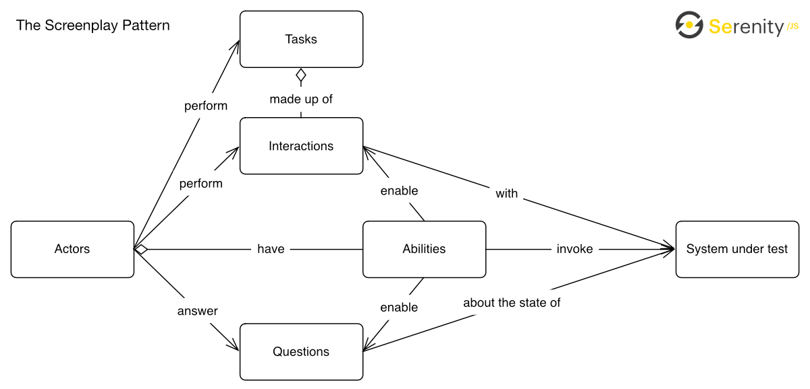

## Abstraction

Web automation UI abstractions refer to the **techniques** and **patterns** used to create a higher-level, more maintainable, and readable representation of user interface interactions within automated tests or scripts. 

These abstractions aim to hide the underlying complexities of interacting directly with web elements, making automation code more robust and easier to manage.

### Key aspects:

- **Page Object Model (POM)**: Encapsulates web page elements and their interactions into a single class, making it easier to manage and maintain test code.

- **Component-Based Abstractions**: Similar to POM, but focused on reusable UI components (e.g., a navigation bar, a search widget, a table). Each component can have its own class and methods, allowing for modular and reusable automation code.

- **Fluent APIs**: These provide a more readable and expressive way to chain multiple actions together. Instead of separate lines for each interaction, fluent APIs allow for a continuous flow of operations.

- **Test Framework Integrations**: Abstractions are often integrated within testing frameworks (e.g., Selenium, Playwright, Cypress) to provide a structured way of interacting with the UI. These frameworks themselves offer various levels of abstraction over direct browser interactions.

- **Data-Driven Abstractions**: Separating test data from the automation logic allows for easier maintenance and expansion of test cases. This can involve using external data sources (e.g., Excel, CSV, databases) to feed different inputs into the UI interactions.
  

## Page Fragment

A web automation page fragment refers to a reusable and self-contained section of a web page that can be independently managed and interacted with during automation. This approach enhances test maintainability and reusability, particularly in Page Object Model (POM) implementations

> Example:

The LoginFormFragment class encapsulates all elements and actions related to the login form.
```python
class LoginFormFragment:
    def __init__(self, page: Page):
        self.page = page
        self.username = page.get_by_role("textbox", name="Username")
        self.password = page.get_by_role("textbox", name="Password")
        self.login_button = page.get_by_role("button", name="Login")
```

The LoginPage class then uses an instance of LoginFormFragment to interact with the login form, rather than directly managing its elements.
```python
class LoginPage:    
    def __init__(self, page: Page):
        self.page = page
        self.login_form = LoginFormFragment(page)
```

This separation of concerns makes the code more organized, readable, and easier to maintain. If the login form's structure changes, only the LoginFormFragment needs modification, not every page object that uses it.

## Page Factory

Page Factory is a method of implementing the Page Object Model (POM) in Selenium. It enhances POM by initializing web elements at runtime and providing additional features for better test efficiency.

To support the Page Object pattern, Page Factory in Python uses a dictionary to declare all web elements, where dictionary keys act as WebElement or class member variables with extended WebElement methods.


## Page Object and Page Factory

### POM vs PageFactory

| Criteria             | Page Object Model (POM)                                                          | Page Factory                                                                  |
| -------------------- | -------------------------------------------------------------------------------- | ----------------------------------------------------------------------------- |
| Code Repetition      | Higher, as locators are manually initialized.                                    | Reduced, as elements are initialized automatically using @FindBy annotations. |
| Code Reusability     | Reusability is achieved through page methods.                                    | Reusability is improved as element initialization is automated.               |
| Code Snippet         | Requires explicit declaration of locators.                                       | Uses @FindBy annotations for cleaner and shorter code snippets.               |
| Code Maintainability | High maintainability since locators are in one place.                            | Higher maintainability due to automated element initialization.               |
| Code Clarity         | This is clearer because the page methods are more explicit and self-explanatory. | Less clear due to @FindBy annotations that may hide logic details.            |
| Code Complexity      | Moderate as it follows a clear structure.                                        | Slightly complex due to annotations and lazy initialization.                  |
| Code Increases       | The code size may increase if locators are repeated.                             | Code size remains minimal due to automated initialization and annotations.    |
| Code Readability     | Easy to read as methods are descriptive and explicit.                            | Annotations may affect readability for beginners.                             |

				

## Extended WebElements Methods

|   |  |
| --------  | ------------- |
| set_text	|   get_text    |
| clear_text	|click_button|
| double_click	|get_list_item_count|
| select_element_by_text	|select_element_by_index|
| select_element_by_value	|get_all_list_item|
| get_list_selected_item	|highlight|
| is_Enabled	|is_Checked|
| getAttribute	|hover|
| visibility_of_element_located	|invisibility_of_element_located|
| element_to_be_clickable	|text_to_be_present_in_element|
| context_click	|execute_script|
| click_and_hold	|release|
| hover_with_offset	| |

> Installation
```bash
pip install selenium-pagefactory
```
> Example

```python
from seleniumpagefactory.Pagefactory import PageFactory
from selenium.webdriver.common.by import By

class ElementsPage(PageFactory):
    def __init__(self, driver):
        self.driver = driver    	# Required
        self.timeout = 15      		#(Optional - Customise your explicit wait for every webElement,Default 10sec)
        self.highlight = True   	#(Optional - To highlight every webElement in PageClass)
        self.mobile_test = False

    locators = {
        "text_box_item": ('id', 'item-0'),
        "username_text_box": ('id', 'userName'),
        "email_text_box": ('id', 'userEmail'),
        "current_address_text_box": ('id', 'currentAddress'),
        "permanent_address_text_box": ('id', 'permanentAddress'),
        "submit_button": ('id', 'submit')
    }

    def click_text_box_item(self):
        self.text_box_item.click()

    def enter_username(self, username):
        self.username_text_box.send_keys(username)
```

### What are Design Patterns in Selenium?

Reusable solutions that bring structure, scalability, and maintainability to Selenium test automation by eliminating redundancy and improving collaboration.

### Common Design Patterns in Selenium

- Page Object Model (POM): Encapsulates page elements & actions for cleaner scripts.
- Singleton Pattern: Ensures only one WebDriver instance across tests.
- Factory Pattern: Centralized driver object creation for flexibility.
- Facade Pattern: Simplifies complex workflows with a unified interface.
- Data-Driven Pattern: Separates test data from logic to support parameterization & cross-browser testing.

### Benefits of Using Design Patterns

- Improved code reusability & readability
- Lower maintenance overhead in large suites
- Better scalability as coverage grows
- Easier collaboration across QA teams
- Increased test reliability & consistency


## Screenplay Pattern

The Screenplay Pattern uses the system metaphor of a **stage performance**, helping you model each test scenario like a little screenplay describing how the actors should go about performing their activities while interacting with the system under test.

Following the Screenplay Pattern helps you capture:

- Who the actors interacting with your system are
- Why they interact with your system
- What they need to do to accomplish their goals
How exactly they would go about that

The five building blocks of the Screenplay Pattern are:

- **Actors**, who represent people and external systems interacting with the system under test
- **Abilities**, that act as thin wrappers around any integration libraries required to interact with the system under test
- **Interactions**, which represent the low-level activities an actor can perform using a given interface
- **Tasks**, used to model sequences of activities as meaningful steps of a business workflow in your domain
- **Questions**, used to retrieve information from the system under test and the test execution environment



### Screenpy
> Installation

```bash
pip install screenpy
```

> Installation with plugins selenium, requests, allure

```bash
pip install "screenpy[selenium,requests,allure]"
```
## Actors
Example:
```python
from screenpy import Actor

actor = Actor.named("Edwin")
```

> demoqa example:
```python
import time
from screenpy.actor import Actor
from screenpy_selenium.abilities import BrowseTheWeb
from screenpy_selenium.actions import Open
from screenpy_selenium.questions import BrowserTitle
from screenpy.resolutions import Equals
from screenpy import See
from screenpy_selenium.target import Target
from screenpy_selenium.actions import Click
from selenium.webdriver.common.by import By
from screenpy_selenium.questions import Text

def test_demoqa_elements_page():
    # 1. Instantiate an Actor and give them the ability to browse the web
    #    (using Selenium WebDriver, which ScreenPy Selenium handles).
    actor = Actor.named("Edwin").who_can(BrowseTheWeb.using_chrome()) 
    # You can also use .using_firefox() or provide a specific WebDriver instance.

    # 2. The Actor performs an action: opening a URL.
    actor.attempts_to(
        Open.their_browser_on("https://demoqa.com/")
    )

    # 3. The Actor asks a question and asserts the answer.
    actor.should(See.the(BrowserTitle(), Equals("DEMOQA")))

    elements_link = Target.the("elements option").located_by("//h5[text()='Elements']")
    actor.attempts_to(Click.on_the(elements_link))

    text_box_menu_item = Target.the("text box menu item").located_by((By.ID, "item-0"))
    actor.attempts_to(Click.on_the(text_box_menu_item))
    
    textbox_title = Target.the("text box title").located_by((By.CSS_SELECTOR, "h1[class='text-center']"))
    actor.should(See.the(Text.of(textbox_title), Equals("Text Box")))

    time.sleep(5)
    # 4. Clean up: the Actor quits their browser.
    actor.exit()
```


## Ref.:

> Page Fragment: https://medium.com/@vanangelov/the-page-object-pattern-not-just-for-pages-a1ad268b20ef

> Page Object: https://www.toolsqa.com/selenium-webdriver/page-object-model/

> Page Object and Page Factory: https://www.frugaltesting.com/blog/page-object-model-and-page-factory-in-selenium-with-python

> Selenium and webdriver: https://www.youtube.com/watch?v=gyfUpOysIF8&t=1517s

> Screenplay Pattern: https://serenity-js.org/handbook/design/screenplay-pattern/

> Screenpy: https://screenpy-docs.readthedocs.io/en/latest/