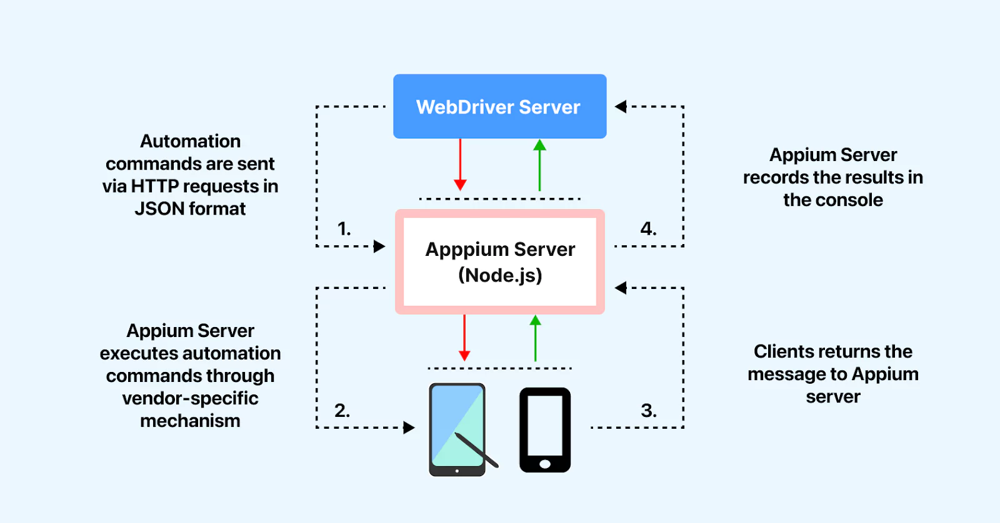

## Appium




> Install android sdk
```bash
sudo apt install android-sdk
```
or use jetbrains toolbox

> Install appium
```bash
npm install -g appium
```

> Ensure you have exported the following variables:

```bash
export ANDROID_HOME=/home/xenomorph/Android/Sdk
export JAVA_HOME=/lib/jvm/java-11-openjdk-amd64
```

> Start server

1. Command line
```bash
appium server --port 4274 --allow-cors
```
2. Use appium desktop
```bash
./Appium-Server-GUI-linux-1.22.3-4.AppImage
```


> List avds

> Go to ANDROID_HOME path
```bash
./emulator -list-avds
```

> Start emulator

1. Using Android emulator
```bash
./emulator -avd Medium_Phone_API_36.1 -gpu swiftshader_indirect
```
2. Using genymotion

> Start appium inspector
```bash
sudo chmod +x Appium-Inspector-2025.8.2-linux-x86_64.AppImage
./Appium-Inspector-2025.8.2-linux-x86_64.AppImage
```
> Use appium inspector


> JSON Representation Example
```json
{
    "platformName": "android",
	"appium:deviceName": "Google Pixel 7",
	"appium:appiumVersion": "3.1.0",
	"appium:platformVersion": "14",
	"appium:automationName": "uiautomator2"
}
```

>  Install apiium python client
```bash
pip install Appium-Python-Client
```


## Refs. :

> Appium testing https://www.lambdatest.com/appium

> Generator https://www.lambdatest.com/capabilities-generator/

> Appium python https://appium.io/docs/en/2.0/quickstart/test-py/

> Appium Desktop https://github.com/appium/appium-desktop/releases

> Emulator genymotion https://www.genymotion.com/product-desktop/download/
